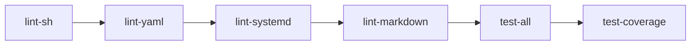

# Contributing

## Workflow

- Use pull requests (no direct commits to `main`).
- Keep changes minimal and aligned with the constraints in [docs/architecture.md](docs/architecture.md).
- Prefer small, reviewable commits with clear messages.

## Required: test before opening a PR

This repo treats the devcontainer as the canonical “clean room” environment.

If you haven’t used devcontainers before: it’s just a Docker image that contains all the lint/test tools this repo
expects. Running CI inside it means we all see the same results (instead of “works on my machine”).

Before opening (or updating) a PR, you must run the full pipeline in the devcontainer and ensure it passes.

Why so strict? Most of the code here is Bash + systemd glue, and tiny differences in tool versions (shellcheck,
kcov, markdownlint, systemd-analyze) can change results. The devcontainer keeps reviews and CI predictable.

### CI pipeline at a glance

These are the same pipeline parts used by GitHub Actions (jobs run in parallel; this diagram is the logical order
when running locally):



### What the stages mean

The pipeline is split into stages so you can run the part you’re working on without waiting for everything.

- `lint-sh`: sanity checks for shell scripts (syntax, shellcheck, formatting).
  This catches common Bash footguns before you even boot a Pi.
- `lint-yaml`: lints YAML files (cloud-init examples and GitHub workflow config).
- `lint-systemd`: verifies `systemd` unit files.
  This doesn’t start services; it checks the unit files are valid and consistent.
- `lint-markdown`: lints Markdown formatting so docs stay readable.
- `tests` (GitHub check: `test-all`): runs Bats tests (unit + integration) that exercise the scripts.
- `coverage` (GitHub check: `test-coverage`): runs the tests under `kcov` and enforces 100% line coverage for `scripts/`.
  That strict gate is intentional: appliance scripts tend to have lots of branches and “only happens on a bad day”
  paths, and we want those paths tested before they ship.

### Option A: VS Code devcontainer (recommended)

1. Open the repository in VS Code.
2. Run “Dev Containers: Reopen in Container”.
3. In the devcontainer terminal:

```bash
./scripts/ci.sh
```

That is the same pipeline GitHub CI uses.

### Option B: Docker CLI (no VS Code)

Build the devcontainer image:

```bash
docker build -t kiosk-retropie-devcontainer -f .devcontainer/Dockerfile .
```

Run the full pipeline inside it:

```bash
docker run --rm \
  -v "$PWD:/work" \
  -w /work \
  kiosk-retropie-devcontainer \
  bash -lc './scripts/ci.sh'
```

### Pipeline parts (optional)

You can run individual stages by name:

```bash
./scripts/ci.sh lint-sh
./scripts/ci.sh lint-yaml
./scripts/ci.sh lint-systemd
./scripts/ci.sh lint-markdown
./scripts/ci.sh tests
./scripts/ci.sh coverage
```

### Local runs (non-devcontainer)

You can run locally with:

```bash
make ci
```

Local environments can drift (tool versions, missing dependencies). If local results differ from CI, trust the
devcontainer result and treat local runs as “best effort”.
