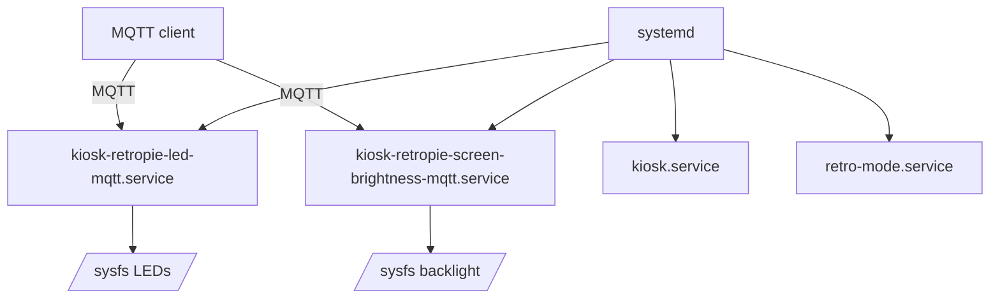

# kiosk-retropie

kiosk-retropie turns a Raspberry Pi into a playful dual-purpose appliance.
Most of the time it is a full-screen Chromium browser showing something useful like a Home Assistant dashboard,
but press Start on a controller and the screen instantly transforms into a RetroPie gaming console.
No menus, no mode toggles, and no reboot.
The website simply gives way to retro games.

## Quick start (deploy to a Pi)

Follow the [Installation](#installation) steps below.

Services are managed by `systemd` and run as a dedicated user (`retropi`) so Xorg/Chromium and input devices
work cleanly without running the main kiosk loop as root.

## How it works

Think of this as a “single-screen appliance” that can only show one thing at a time.

- Most of the time the Pi is a kiosk (full-screen Chromium).
- When you press Start on a controller, the Pi stops the kiosk and switches into RetroPie.
- If the kiosk crashes, the Pi tries to recover into RetroPie automatically (so the screen isn’t just dead).

Under the hood we use `systemd` (the built-in Linux service manager) to start/stop everything, because it’s very
good at doing exactly that reliably.

### Mode switching at a glance

```mermaid
flowchart TD
  LISTEN_KIOSK[kiosk-mode-controller-listener.service]
  LISTEN_TTY[emergency-retro-launch.service]
  FAIL[kiosk-retropie-failover.service]

  KIOSK["kiosk.service<br/>Chromium kiosk"]
  RETRO["retro-mode.service<br/>RetroPie"]

  LISTEN_KIOSK -->|Start button| RETRO
  LISTEN_TTY -->|Start button (TTY)| RETRO

  KIOSK -. OnFailure .-> FAIL
  FAIL --> RETRO

  RETRO -->|exit combo| KIOSK
```

### Glossary

See [docs/glossary.md](docs/glossary.md) for terms used throughout the docs.

## Documentation

- [Architecture](docs/architecture.md)
- [Glossary](docs/glossary.md)

## Architecture at a glance



## Requirements

- Raspberry Pi with display output and USB controller(s)
- Raspberry Pi OS (Debian-based; uses systemd for services)
- Network access on first boot (to fetch the repo)

## Installation

Install over SSH.

1. Install prerequisites:

```bash
sudo apt-get update
sudo apt-get install -y --no-install-recommends ca-certificates curl git
```

1. Create `/etc/kiosk-retropie/config.env` (start from the example):

```bash
sudo mkdir -p /etc/kiosk-retropie
sudo cp /path/to/kiosk-retropie/examples/config.env /etc/kiosk-retropie/config.env
sudo nano /etc/kiosk-retropie/config.env
```

1. Clone the repo and run the installer as root:

```bash
git clone https://github.com/theaussiepom/kiosk-retropie.git /opt/kiosk-retropie
cd /opt/kiosk-retropie
sudo ./scripts/install.sh
```

The installer creates the `retropi` user if it does not already exist, and installs systemd units that run
kiosk/Retro mode under that account.

## Configuration

Runtime configuration lives in `/etc/kiosk-retropie/config.env`.

Start with [examples/config.env](examples/config.env).

Variables below include short explanations and ways to discover sensible values.

### Controller button codes (entry/exit)

Controller button codes come from Linux evdev. Different controllers can emit different codes,
so the entry/exit buttons are configurable.

To discover codes on the Pi:

```bash
sudo kiosk-retropie-controller-codes.sh
```

Press the buttons you want to use and note the `code=` values.

Then set these in `/etc/kiosk-retropie/config.env`:

- `RETROPIE_ENTER_TRIGGER_CODE` (optional, default `315`): button code that enters Retro (kiosk -> Retro)
- `RETROPIE_EXIT_SEQUENCE_CODES` (optional, default `315,304`): comma-delimited exit combo codes (Retro -> kiosk)
  Buttons must be pressed/held together; order doesn't matter.
- `RETROPIE_COMBO_WINDOW_SEC` (optional, default `0.75`): max seconds between first and last button press in the exit combo
- `RETROPIE_ACTION_DEBOUNCE_SEC` (optional, default `1.0`): minimum seconds between actions (prevents double-triggers)

#### On-device calibration checklist

1. SSH into the Pi.
1. Discover the button codes:

    ```bash
    sudo kiosk-retropie-controller-codes.sh
    ```

    Press the buttons you want to use and note the `code=` values.

1. Update `/etc/kiosk-retropie/config.env` with the codes you chose:

    - Set `RETROPIE_ENTER_TRIGGER_CODE` for kiosk -> Retro.
    - For Retro -> kiosk, set `RETROPIE_EXIT_SEQUENCE_CODES` (for example `315,304`).

1. Restart the listeners so they pick up the new config:

    ```bash
    sudo systemctl restart kiosk-mode-controller-listener.service emergency-retro-launch.service
    ```

1. Verify behavior:

    - From kiosk: press your enter trigger and confirm Retro starts.
    - From Retro: press and hold your exit combo within `RETROPIE_COMBO_WINDOW_SEC` and confirm kiosk returns.

### Display

- `KIOSK_URL` (required for kiosk): the full URL to open in Chromium.
- `KIOSK_SCREEN_ROTATION` (optional): `normal`, `left`, `right`, or `inverted`.

Xorg VTs (virtual terminals):

- `KIOSK_X_VT` (optional, default: `7`): VT used by kiosk
- `RETROPIE_X_VT` (optional, default: `8`): VT used by Retro mode

Linux exposes multiple text/graphics “virtual terminals” (numbered sessions). This project uses separate VTs so
kiosk and Retro can cleanly take ownership of the display.

Chromium profile directory:

- `KIOSK_CHROMIUM_PROFILE_DIR` (optional, default: `$HOME/.config/kiosk-retropie-chromium`)

This is Chromium’s “user profile” directory (cookies, local storage, cache, preferences). Set it if you want the
kiosk to keep state across restarts and/or you want to control where that state is stored. The directory must be
writable by the user running the kiosk service (by default, `retropi`).

If you set `KIOSK_CHROMIUM_PROFILE_DIR` to a path outside `retropi`’s home (for example under `/var/lib`), make
sure it’s owned by `retropi:retropi` (or otherwise writable by that user). If the variable is already set when
you run `./scripts/install.sh`, the installer will create the directory and `chown` it to `retropi`.

### ROM sync from NFS (optional)

ROMs are stored locally and can be synced from NFS on boot.

To enable NFS sync, set:

- `NFS_SERVER` (e.g. `nas` or `nas:/export/kiosk-retropie`)

If `NFS_SERVER` is a bare host (e.g. `nas`), the default export path is `/export/kiosk-retropie`.

The NFS share root is expected to contain `roms/` (for ROM sync) and `backups/` (for backups).

If you are not using NFS sync, you can copy ROMs onto the Pi directly.
ROMs live at `/var/lib/kiosk-retropie/retropie/roms` (and RetroPie sees them via `/home/retropi/RetroPie/roms`).
Place files under the usual RetroPie structure, for example:

- `/var/lib/kiosk-retropie/retropie/roms/nes/`
- `/var/lib/kiosk-retropie/retropie/roms/snes/`

- `RETROPIE_ROMS_DIR` (default: `/var/lib/kiosk-retropie/retropie/roms`)
- `RETROPIE_ROMS_SYNC_DELETE` (default: `1`; set to `0` to disable mirroring deletions from NFS)
- `RETROPIE_ROMS_OWNER` (default: `retropi:retropi`)

Optional system filtering:

- `RETROPIE_ROMS_SYSTEMS` (default: empty; if set, only these systems are synced)

### Save data policy

Save files and save states are always local:

- `RETROPIE_SAVES_DIR` (default: `/var/lib/kiosk-retropie/retropie/saves`)
- `RETROPIE_STATES_DIR` (default: `/var/lib/kiosk-retropie/retropie/states`)

### Optional save backup to NFS

An optional periodic backup copies local saves/states to NFS.
It never runs during gameplay (it skips while `retro-mode.service` is active).

- `RETROPIE_SAVE_BACKUP_ENABLED` (default: `1`; set to `0` to disable)
- `RETROPIE_SAVE_BACKUP_SUBDIR` (default: `<hostname>`)
- `RETROPIE_SAVE_BACKUP_DELETE` (default: `1`)

Backup destination defaults to: `/mnt/kiosk-retropie-nfs/backups/<hostname>/`.

### Controller listeners (advanced)

Controller listeners prefer evdev devices under `/dev/input/by-id`.

- `RETROPIE_INPUT_BY_ID_DIR` (optional, default: `/dev/input/by-id`)
- `RETROPIE_INPUT_DEVICES` (optional; explicit colon/comma/space-separated device paths for testing)
- `RETROPIE_ACTION_DEBOUNCE_SEC` (optional, default: `1.0`)

Safety / loop limits:

- `RETROPIE_MAX_TRIGGERS` (optional; max trigger events before exiting)
- `RETROPIE_MAX_LOOPS` (optional; max poll loops before exiting)

These exist primarily for testing and diagnostics. They cause the controller listener loop to exit after a bounded
number of iterations/events instead of running forever. Leave them unset (or `0`) for normal appliance operation.

### LED MQTT bridge (optional)

- `KIOSK_LED_MQTT_ENABLED` (default: `0`; set to `1` to enable)
- `KIOSK_MQTT_TOPIC_PREFIX` (default: `kiosk-retropie`)
- `KIOSK_LED_MQTT_POLL_SEC` (optional, default: `2`)
  Poll sysfs and publish state changes made outside MQTT.
- `KIOSK_LED_MQTT_MAX_LOOPS` (optional, default: `0`)
  Max poll loops before exiting (`0` means run forever).

Broker settings:

- `MQTT_HOST` (required when enabled)
- `MQTT_PORT` (default: `1883`)
- `MQTT_USERNAME` (optional)
- `MQTT_PASSWORD` (optional)
- `MQTT_TLS` (default: `0`; set to `1` to enable TLS)

`KIOSK_MQTT_TOPIC_PREFIX` controls the root topic used by the MQTT bridges (for example
`<prefix>/led/act/set`). If you run multiple kiosks on one broker, give each kiosk a unique prefix.

### Screen brightness MQTT bridge (optional)

Controls the display backlight brightness via sysfs (`/sys/class/backlight`).

- `KIOSK_SCREEN_BRIGHTNESS_MQTT_ENABLED` (default: `0`; set to `1` to enable)
- `KIOSK_MQTT_TOPIC_PREFIX` (default: `kiosk-retropie`)
- `KIOSK_SCREEN_BRIGHTNESS_MQTT_POLL_SEC` (optional, default: `2`)
  Poll sysfs and publish state changes made outside MQTT.
- `KIOSK_SCREEN_BRIGHTNESS_MQTT_MAX_LOOPS` (optional, default: `0`)
  Max poll loops before exiting (`0` means run forever).

Broker settings (same as LED MQTT bridge):

- `MQTT_HOST` (required when enabled)
- `MQTT_PORT` (default: `1883`)
- `MQTT_USERNAME` (optional)
- `MQTT_PASSWORD` (optional)
- `MQTT_TLS` (default: `0`; set to `1` to enable TLS)

Backlight selection is handled by the application.

## MQTT LED control (optional)

### MQTT integration at a glance

If your dashboard/controller is running on a different host than the kiosk Pi, MQTT is the bridge.

MQTT provides a simple bridge if your dashboard/controller runs on a different host than the kiosk Pi.

By default the Raspberry Pi board LEDs are kept **on** as a simple “it’s alive” signal. An MQTT client can
turn them **off** (night mode) by driving sysfs on the appliance.

If your dashboard/controller is running on a different host than the kiosk Pi, MQTT is the bridge: the appliance
exposes an **MQTT-controlled** LED switch.

### LED overview

- The Pi runs `kiosk-retropie-led-mqtt.service`.
- It subscribes to MQTT topics and calls a local sysfs writer.
- An MQTT client publishes `ON`/`OFF` to those topics.
- The appliance also periodically polls sysfs and republishes retained state,
  so the client reflects changes made outside MQTT.

### LED MQTT topics

Default prefix: `kiosk-retropie` (set `KIOSK_MQTT_TOPIC_PREFIX`).

Command topics:

- `kiosk-retropie/led/act/set`
- `kiosk-retropie/led/pwr/set`
- `kiosk-retropie/led/all/set`

Payloads:

- `ON`
- `OFF`

State topics (retained, so the client can see the current state immediately):

- `kiosk-retropie/led/act/state`
- `kiosk-retropie/led/pwr/state`

### LED MQTT YAML example

MQTT broker settings are configured in your MQTT client.

Example switches:

```yaml
mqtt:
  switch:
    - name: "kiosk-retropie ACT LED"
      command_topic: "kiosk-retropie/led/act/set"
      state_topic: "kiosk-retropie/led/act/state"
      payload_on: "ON"
      payload_off: "OFF"

    - name: "kiosk-retropie PWR LED"
      command_topic: "kiosk-retropie/led/pwr/set"
      state_topic: "kiosk-retropie/led/pwr/state"
      payload_on: "ON"
      payload_off: "OFF"

    - name: "kiosk-retropie LEDs (All)"
      command_topic: "kiosk-retropie/led/all/set"
      payload_on: "ON"
      payload_off: "OFF"
```

## MQTT screen brightness control (optional)

### Screen brightness overview

- The Pi runs `kiosk-retropie-screen-brightness-mqtt.service`.
- An MQTT client publishes brightness percent (0-100).
- The appliance writes to `/sys/class/backlight/<device>/brightness` and publishes retained state.
- The appliance also periodically polls sysfs and republishes retained state,
  so the client reflects changes made outside MQTT.

### Screen brightness MQTT topics

Default prefix: `kiosk-retropie` (set `KIOSK_MQTT_TOPIC_PREFIX`).

- Command: `kiosk-retropie/screen/brightness/set` (payload: `0`-`100`)
- State (retained): `kiosk-retropie/screen/brightness/state` (payload: `0`-`100`)

### Screen brightness MQTT YAML example

Example number entity:

```yaml
mqtt:
  number:
    - name: "kiosk-retropie Screen Brightness"
      command_topic: "kiosk-retropie/screen/brightness/set"
      state_topic: "kiosk-retropie/screen/brightness/state"
      min: 0
      max: 100
      step: 1
```

## Operation

Key services:

- `kiosk.service`: kiosk mode (VT7 by default)
- `retro-mode.service`: Retro mode (VT8 by default)
- `kiosk-mode-controller-listener.service`: Start button listener during kiosk mode
- `emergency-retro-launch.service`: always-on Start button listener (TTY)
- `healthcheck.timer`: periodic fail-open check

Manual mode switching:

```bash
sudo systemctl start retro-mode.service
sudo systemctl start kiosk.service
```

Logs:

```bash
journalctl -u kiosk.service -b --no-pager
journalctl -u retro-mode.service -b --no-pager
```

## Updating and testing on a Pi (no reflashing)

Most iteration does not require reflashing.

### Config-only changes

1. Edit `/etc/kiosk-retropie/config.env`.
1. Restart the affected unit(s):

```bash
sudo systemctl restart kiosk.service
sudo systemctl restart kiosk-retropie-led-mqtt.service
```

### Reinstall / update from a new git ref

The installer is guarded by a marker file.

1. Update the repo checkout under `/opt/kiosk-retropie` (or wherever you cloned it).
1. Stop running services (avoid fighting for X):

```bash
sudo systemctl stop \
  kiosk.service \
  retro-mode.service \
  kiosk-mode-controller-listener.service \
  kiosk-retropie-failover.service \
  || true
```

1. Remove the marker and re-run the installer:

```bash
sudo rm -f /var/lib/kiosk-retropie/installed /var/lock/kiosk-retropie-install.lock
cd /opt/kiosk-retropie
sudo ./scripts/install.sh
```

## Troubleshooting

This section focuses on diagnosing issues on a Raspberry Pi running kiosk-retropie.

Most problems can be solved without reflashing by inspecting journald logs, checking systemd unit
state, and validating `/etc/kiosk-retropie/config.env`.

### Quick triage (start here)

1. See what systemd thinks is happening:

```bash
systemctl status \
  kiosk.service \
  retro-mode.service \
  kiosk-mode-controller-listener.service \
  emergency-retro-launch.service \
  kiosk-retropie-failover.service \
  --no-pager
```

1. Check recent logs for the unit that is failing:

```bash
journalctl -u kiosk.service -b --no-pager
journalctl -u retro-mode.service -b --no-pager
```

1. Confirm configuration is present and sane:

```bash
sudo test -f /etc/kiosk-retropie/config.env && sudo sed -n '1,200p' /etc/kiosk-retropie/config.env
```

1. Confirm the installer marker state:

```bash
ls -l /var/lib/kiosk-retropie/installed || true
```

### Re-running the installer

The installer is guarded by a marker file.

To force a re-run:

```bash
sudo rm -f /var/lib/kiosk-retropie/installed /var/lock/kiosk-retropie-install.lock
cd /opt/kiosk-retropie
sudo ./scripts/install.sh
```

### Kiosk problems

#### Symptom: black screen / kiosk never appears

Check logs:

```bash
journalctl -u kiosk.service -b --no-pager
```

Common causes:

- `KIOSK_URL` is missing.
- Chromium is not installed (package name differs by distro).
- Xorg cannot start on the configured VT.

Validate config:

```bash
grep -n '^KIOSK_URL=' /etc/kiosk-retropie/config.env || true
```

Validate chromium presence:

```bash
command -v chromium-browser || true
command -v chromium || true
```

Validate Xorg and xinit:

```bash
command -v xinit || true
test -x /usr/lib/xorg/Xorg && echo "Xorg present"
```

#### Symptom: kiosk starts then crashes repeatedly

`kiosk.service` is configured to fail over to Retro when it repeatedly fails.

Check whether failover triggered:

```bash
systemctl status kiosk-retropie-failover.service --no-pager
journalctl -u kiosk-retropie-failover.service -b --no-pager
```

### Retro mode problems

#### Symptom: Retro mode starts then immediately returns to kiosk

This is normal if RetroPie (EmulationStation) is not installed yet.
`retro-mode.sh` exits 0 when `emulationstation` is missing to avoid thrashing.

Confirm:

```bash
command -v emulationstation || true
journalctl -u retro-mode.service -b --no-pager
```

#### Symptom: Retro mode fails with “xinit not found”

Install dependencies (if you are manually debugging outside the one-shot installer):

```bash
sudo apt-get update
sudo apt-get install -y xinit xserver-xorg
```

### Controller input problems

The controller listeners read evdev events via `/dev/input/by-id/*event-joystick`.
If your controller only exposes legacy `/dev/input/js*` nodes, it will be ignored.

#### Symptom: pressing Start does nothing

1. Confirm the listener is running:

```bash
systemctl status emergency-retro-launch.service --no-pager
systemctl status kiosk-mode-controller-listener.service --no-pager
```

1. Confirm the device shows up under by-id:

```bash
ls -l /dev/input/by-id/ | sed -n '1,200p'
```

1. Inspect listener logs:

```bash
journalctl -u emergency-retro-launch.service -b --no-pager
journalctl -u kiosk-mode-controller-listener.service -b --no-pager
```

#### Symptom: controller is detected but Start button does not trigger

The enter trigger defaults to `315` (`BTN_START`). If your controller maps Start differently, you
can override `RETROPIE_ENTER_TRIGGER_CODE` in `/etc/kiosk-retropie/config.env`.

If you are unsure of your key code:

```bash
sudo apt-get update
sudo apt-get install -y evtest
sudo evtest
```

Then restart the listener:

```bash
sudo systemctl restart emergency-retro-launch.service
```

### NFS ROM sync problems

#### Symptom: ROMs do not sync on boot

1. Confirm the unit is enabled and check logs:

```bash
systemctl status boot-sync.service --no-pager
journalctl -u boot-sync.service -b --no-pager
```

1. Validate config:

```bash
grep -n '^NFS_SERVER=' /etc/kiosk-retropie/config.env || true
```

1. Confirm mount status:

```bash
mountpoint -q /mnt/kiosk-retropie-nfs && echo "mounted" || echo "not mounted"
mount | grep kiosk-retropie-nfs || true
```

### Save/state backup problems (optional)

#### Symptom: backups never appear

1. Ensure it is enabled:

```bash
grep -n '^RETROPIE_SAVE_BACKUP_ENABLED=' /etc/kiosk-retropie/config.env || true
```

1. Inspect the timer and last run:

```bash
systemctl status save-backup.timer save-backup.service --no-pager
journalctl -u save-backup.service -b --no-pager
```

Note: the backup intentionally skips while `retro-mode.service` is active.

### LED MQTT problems (optional)

#### Symptom: MQTT toggle does nothing

1. Ensure the service is enabled and configured:

```bash
systemctl status kiosk-retropie-led-mqtt.service --no-pager
grep -n '^KIOSK_LED_MQTT_ENABLED=\|^MQTT_HOST=' /etc/kiosk-retropie/config.env || true
```

1. Check logs:

```bash
journalctl -u kiosk-retropie-led-mqtt.service -b --no-pager
```

1. Confirm mosquitto clients are installed:

```bash
command -v mosquitto_sub || true

## Why we don’t use Docker on the Pi

This project runs directly on Raspberry Pi OS with systemd rather than running the appliance services in Docker
containers.

Reasons:

- The appliance is tightly integrated with host resources (Xorg/VTs, logind, evdev input devices, sysfs
  LEDs/backlight, systemd ordering).
- We want simple, deterministic boot behavior with systemd as the single orchestrator.
- Keeping runtime dependencies minimal reduces moving parts on a constrained device.

In practice, you can diagnose most issues with `systemctl` and `journalctl`, and the device still behaves
sensibly if networking (or MQTT) is down.

Docker is still used for development parity via the devcontainer (toolchain + CI reproducibility), not for the
production appliance runtime.
command -v mosquitto_pub || true
```

## Development

Repo development, linting, and tests are documented in [CONTRIBUTING.md](CONTRIBUTING.md).

## Contributing

See [CONTRIBUTING.md](CONTRIBUTING.md).

## License

MIT. See [LICENSE](LICENSE).
