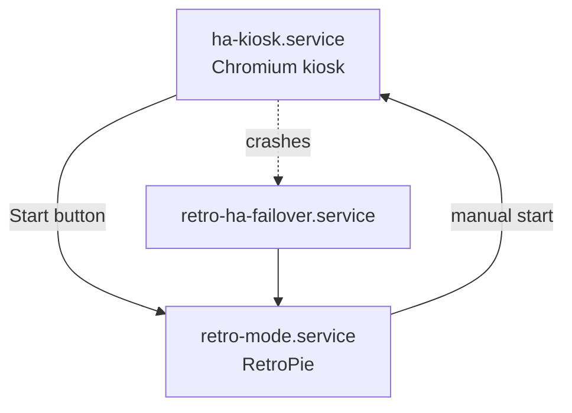
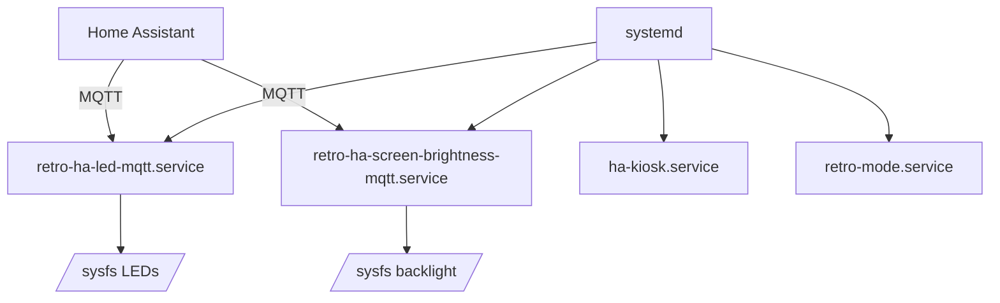
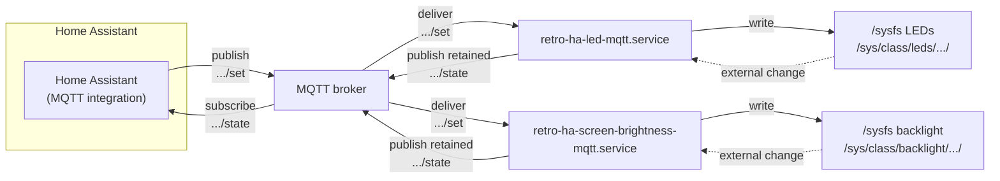

# retro-ha-appliance

## Quick start (dev + CI)

The canonical, repeatable test environment is the devcontainer.

Build the devcontainer image:

```bash
docker build -t retro-ha-devcontainer -f .devcontainer/Dockerfile .
```

Run the full CI pipeline inside it:

```bash
docker run --rm \
  -v "$PWD:/work" \
  -w /work \
  retro-ha-devcontainer \
  bash -lc './scripts/ci.sh'
```

Or, use the Makefile (requires `make` + Docker on your host):

```bash
make ci
```

See [CONTRIBUTING.md](CONTRIBUTING.md) for the required pre-PR checks.

This repo turns a Raspberry Pi into a dual-mode appliance with strict display ownership:

- Home Assistant kiosk mode (default): full-screen Chromium
- RetroPie mode (on-demand): launched by controller input

The focus is determinism, recoverability, and fail-open behavior.
If the HA kiosk isn’t healthy, you can still get into RetroPie.

## How it works (plain English)

Think of this as a “single-screen appliance” that can only show one thing at a time.

- Most of the time the Pi is a Home Assistant kiosk (full-screen Chromium).
- When you press Start on a controller, the Pi stops the kiosk and switches into RetroPie.
- If the kiosk crashes, the Pi tries to recover into RetroPie automatically (so the screen isn’t just dead).

Under the hood we use `systemd` (the built-in Linux service manager) to start/stop everything, because it’s very
good at doing exactly that reliably.

### Mode switching at a glance



### Glossary

See [docs/glossary.md](docs/glossary.md) for terms used throughout the docs.

## Why we don’t use Docker on the Pi

This project runs directly on Raspberry Pi OS with systemd rather than running the appliance services in Docker
containers.

Reasons:

- The appliance is tightly integrated with host resources (Xorg/VTs, logind, evdev input devices, sysfs
  LEDs/backlight, systemd ordering).
- We want simple, deterministic boot behavior with systemd as the single orchestrator.
- Keeping runtime dependencies minimal reduces moving parts on a constrained device.

In practice, this makes failures easier to reason about: you can diagnose almost everything with `systemctl` and
`journalctl`, and the device still behaves sensibly if networking (or MQTT) is down.

Docker is still used for development parity via the devcontainer (toolchain + CI reproducibility), not for the
production appliance runtime.

## Documentation

- [Architecture](docs/architecture.md)
- [Glossary](docs/glossary.md)
- [Config examples](docs/config-examples.md)

## Architecture at a glance



## Requirements

- Raspberry Pi with display output and USB controller(s)
- Raspberry Pi OS (Debian-based; uses systemd for services)
- Network access on first boot (to fetch the repo)

## Installation

### Pi Imager + cloud-init (recommended)

1. Use Raspberry Pi Imager to flash Raspberry Pi OS.
1. Provide cloud-init user-data (first-boot provisioning) based on
   [examples/pi-imager/user-data.example.yml](examples/pi-imager/user-data.example.yml).
1. Fill in at least:

```bash
RETRO_HA_REPO_URL=...
RETRO_HA_REPO_REF=<tag-or-commit>
HA_URL=<your-home-assistant-dashboard-url>
```

1. Boot the Pi.

Verify installation:

```bash
systemctl status retro-ha-install.service --no-pager
ls -l /var/lib/retro-ha/installed || true
```

### Manual install (no cloud-init)

If you cannot use cloud-init, you can install by SSH.

1. Install prerequisites:

```bash
sudo apt-get update
sudo apt-get install -y --no-install-recommends ca-certificates curl git
```

1. Create `/etc/retro-ha/config.env` (start from the example):

```bash
sudo mkdir -p /etc/retro-ha
sudo cp /path/to/retro-ha-appliance/examples/config.env.example /etc/retro-ha/config.env
sudo nano /etc/retro-ha/config.env
```

1. Clone the repo and run the installer as root:

```bash
git clone https://github.com/theaussiepom/retro-ha-appliance.git /opt/retro-ha-appliance
cd /opt/retro-ha-appliance
sudo ./scripts/install.sh
```

## Configuration

Runtime configuration lives in `/etc/retro-ha/config.env`.

Start with [examples/config.env.example](examples/config.env.example).

### Controller button codes (entry/exit)

Controller button codes come from Linux evdev. Different controllers can emit different codes,
so the entry/exit buttons are configurable.

To discover codes on the Pi:

```bash
sudo retro-ha-controller-codes.sh
```

Press the buttons you want to use and note the `code=` values.

Then set these in `/etc/retro-ha/config.env`:

- `RETRO_HA_RETRO_ENTER_TRIGGER_CODE` (optional, default `315`): button code that enters Retro (HA -> Retro)
- `RETRO_HA_RETRO_EXIT_TRIGGER_CODE` (optional, default `315`): button code that triggers the exit combo
- `RETRO_HA_RETRO_EXIT_SECOND_CODE` (optional, default `304`): second button for exit combo (press this, then trigger)
- `RETRO_HA_COMBO_WINDOW_SEC` (optional, default `0.75`): max seconds between the second button and trigger
- `RETRO_HA_START_DEBOUNCE_SEC` (optional, default `1.0`): debounce for trigger presses

#### On-device calibration checklist

1. SSH into the Pi.
1. Discover the button codes:

    ```bash
    sudo retro-ha-controller-codes.sh
    ```

    Press the buttons you want to use and note the `code=` values.

1. Update `/etc/retro-ha/config.env` with the codes you chose:
    Set `RETRO_HA_RETRO_ENTER_TRIGGER_CODE` for HA -> Retro.
  For Retro -> HA, set `RETRO_HA_RETRO_EXIT_SECOND_CODE` and `RETRO_HA_RETRO_EXIT_TRIGGER_CODE`
  (second button first, then trigger).

1. Restart the listeners so they pick up the new config:

    ```bash
    sudo systemctl restart ha-mode-controller-listener.service emergency-retro-launch.service
    ```

1. Verify behavior:
    From HA kiosk: press your enter trigger and confirm Retro starts.
    From Retro: press your exit combo (second button, then trigger within `RETRO_HA_COMBO_WINDOW_SEC`) and confirm HA returns.

Backwards compatibility:

- `RETRO_HA_START_BUTTON_CODE` (legacy) still works as the default trigger code.
- `RETRO_HA_A_BUTTON_CODE` (legacy) still works as the default exit second code.

### Repo pinning (first boot installer)

The first-boot bootstrap and installer fetch this repo using:

- `RETRO_HA_REPO_URL` (required)
- `RETRO_HA_REPO_REF` (required): branch/tag/commit (pinning to a tag/commit is recommended)
- `RETRO_HA_CHECKOUT_DIR` (optional, default: `/opt/retro-ha-appliance`)

### Display

- `HA_URL` (required for kiosk): the full Home Assistant dashboard URL to open in Chromium.
- `RETRO_HA_SCREEN_ROTATION` (optional): `normal`, `left`, `right`, or `inverted`.

Xorg VTs (virtual terminals):

- `RETRO_HA_X_VT` (optional, default: `7`): VT used by HA kiosk
- `RETRO_HA_RETRO_X_VT` (optional, default: `8`): VT used by Retro mode

Chromium profile directory:

- `RETRO_HA_CHROMIUM_PROFILE_DIR` (optional, default: `$HOME/.config/retro-ha-chromium`)

### ROM sync from NFS (optional)

ROMs are stored locally and can be synced from NFS on boot.

Required to enable NFS sync:

- `NFS_SERVER` (e.g. `192.168.1.20`)
- `NFS_PATH` (e.g. `/export/retropie`)

Optional variables:

- `RETRO_HA_NFS_MOUNT_POINT` (default: `/mnt/retro-ha-roms`)
- `RETRO_HA_NFS_MOUNT_OPTIONS` (default: `ro`)
- `RETRO_HA_NFS_ROMS_SUBDIR` (default: empty)
- `RETRO_HA_ROMS_DIR` (default: `/var/lib/retro-ha/retropie/roms`)
- `RETRO_HA_ROMS_SYNC_DELETE` (default: `0`; set to `1` to mirror deletions from NFS)
- `RETRO_HA_ROMS_OWNER` (default: `retropi:retropi`)

Optional system filtering:

- `RETRO_HA_ROMS_SYSTEMS` (default: empty; if set, only these systems are synced)
- `RETRO_HA_ROMS_EXCLUDE_SYSTEMS` (default: empty; systems to skip)

### Save data policy

Save files and save states are always local:

- `RETRO_HA_SAVES_DIR` (default: `/var/lib/retro-ha/retropie/saves`)
- `RETRO_HA_STATES_DIR` (default: `/var/lib/retro-ha/retropie/states`)

### Optional save backup to NFS

An optional periodic backup copies local saves/states to NFS.
It never runs during gameplay (it skips while `retro-mode.service` is active).

- `RETRO_HA_SAVE_BACKUP_ENABLED` (default: `0`; set to `1` to enable)
- `RETRO_HA_SAVE_BACKUP_DIR` (default: `/mnt/retro-ha-backup`)
- `RETRO_HA_SAVE_BACKUP_SUBDIR` (default: `retro-ha-saves`)
- `RETRO_HA_SAVE_BACKUP_DELETE` (default: `0`)

NFS settings (defaults to `NFS_SERVER`/`NFS_PATH` if unset):

- `RETRO_HA_SAVE_BACKUP_NFS_SERVER`
- `RETRO_HA_SAVE_BACKUP_NFS_PATH`
- `RETRO_HA_SAVE_BACKUP_NFS_MOUNT_OPTIONS` (default: `rw`)

### Controller listeners (advanced)

Controller listeners prefer evdev devices under `/dev/input/by-id`.

- `RETRO_HA_INPUT_BY_ID_DIR` (optional, default: `/dev/input/by-id`)
- `RETRO_HA_START_BUTTON_CODE` (optional, default: `315`)
- `RETRO_HA_START_DEBOUNCE_SEC` (optional, default: `1.0`)

Safety / loop limits:

- `RETRO_HA_MAX_TRIGGERS` (optional; max "start" events before exiting)
- `RETRO_HA_MAX_LOOPS` (optional; max poll loops before exiting)

### LED MQTT bridge (optional)

- `RETRO_HA_LED_MQTT_ENABLED` (default: `0`; set to `1` to enable)
- `RETRO_HA_MQTT_TOPIC_PREFIX` (default: `retro-ha`)
- `RETRO_HA_LED_MQTT_POLL_SEC` (optional, default: `2`)
  Poll sysfs and publish state changes made outside MQTT.

Broker settings:

- `MQTT_HOST` (required when enabled)
- `MQTT_PORT` (default: `1883`)
- `MQTT_USERNAME` (optional)
- `MQTT_PASSWORD` (optional)
- `MQTT_TLS` (default: `0`; set to `1` to enable TLS)

### Screen brightness MQTT bridge (optional)

Controls the display backlight brightness via sysfs (`/sys/class/backlight`).

- `RETRO_HA_SCREEN_BRIGHTNESS_MQTT_ENABLED` (default: `0`; set to `1` to enable)
- `RETRO_HA_MQTT_TOPIC_PREFIX` (default: `retro-ha`)
- `RETRO_HA_BACKLIGHT_NAME` (optional)
  Which backlight device under `/sys/class/backlight` to control; defaults to the first one found.
- `RETRO_HA_SCREEN_BRIGHTNESS_MQTT_POLL_SEC` (optional, default: `2`)
  Poll sysfs and publish state changes made outside MQTT.

Broker settings (same as LED MQTT bridge):

- `MQTT_HOST` (required when enabled)
- `MQTT_PORT` (default: `1883`)
- `MQTT_USERNAME` (optional)
- `MQTT_PASSWORD` (optional)
- `MQTT_TLS` (default: `0`; set to `1` to enable TLS)

## Home Assistant LED control (optional)

### MQTT integration at a glance

If Home Assistant is running on a different host than the kiosk Pi, MQTT is the bridge.

This diagram shows the message flow (commands go one way, state comes back as retained messages so HA can show the
current value immediately):



By default the Raspberry Pi board LEDs are kept **on** as a simple “it’s alive” signal. Home Assistant can
turn them **off** (night mode) by driving sysfs on the appliance.

If Home Assistant is running on a different host than the kiosk Pi, MQTT is the bridge: the appliance
exposes an **MQTT-controlled** LED switch.

### LED overview

- The Pi runs `retro-ha-led-mqtt.service`.
- It subscribes to MQTT topics and calls a local sysfs writer.
- Home Assistant publishes `ON`/`OFF` to those topics.
- The appliance also periodically polls sysfs and republishes retained state,
  so Home Assistant reflects changes made outside MQTT.

### LED MQTT topics

Default prefix: `retro-ha` (set `RETRO_HA_MQTT_TOPIC_PREFIX`).

Command topics:

- `retro-ha/led/act/set`
- `retro-ha/led/pwr/set`
- `retro-ha/led/all/set`

Payloads:

- `ON`
- `OFF`

State topics (retained, so Home Assistant can see the current state immediately):

- `retro-ha/led/act/state`
- `retro-ha/led/pwr/state`

### LED Home Assistant YAML example

MQTT broker settings are configured in Home Assistant’s MQTT integration.

Example switches:

```yaml
mqtt:
  switch:
    - name: "Retro HA ACT LED"
      command_topic: "retro-ha/led/act/set"
      state_topic: "retro-ha/led/act/state"
      payload_on: "ON"
      payload_off: "OFF"

    - name: "Retro HA PWR LED"
      command_topic: "retro-ha/led/pwr/set"
      state_topic: "retro-ha/led/pwr/state"
      payload_on: "ON"
      payload_off: "OFF"

    - name: "Retro HA LEDs (All)"
      command_topic: "retro-ha/led/all/set"
      payload_on: "ON"
      payload_off: "OFF"
```

## Home Assistant screen brightness control (optional)

### Screen brightness overview

- The Pi runs `retro-ha-screen-brightness-mqtt.service`.
- Home Assistant publishes brightness percent (0-100).
- The appliance writes to `/sys/class/backlight/<device>/brightness` and publishes retained state.
- The appliance also periodically polls sysfs and republishes retained state,
  so Home Assistant reflects changes made outside MQTT.

### Screen brightness MQTT topics

Default prefix: `retro-ha` (set `RETRO_HA_MQTT_TOPIC_PREFIX`).

- Command: `retro-ha/screen/brightness/set` (payload: `0`-`100`)
- State (retained): `retro-ha/screen/brightness/state` (payload: `0`-`100`)

### Screen brightness Home Assistant YAML example

Example number entity:

```yaml
mqtt:
  number:
    - name: "Retro HA Screen Brightness"
      command_topic: "retro-ha/screen/brightness/set"
      state_topic: "retro-ha/screen/brightness/state"
      min: 0
      max: 100
      step: 1
```

## Operation

Key services:

- `ha-kiosk.service`: HA kiosk mode (VT7 by default)
- `retro-mode.service`: Retro mode (VT8 by default)
- `ha-mode-controller-listener.service`: Start button listener during HA mode
- `emergency-retro-launch.service`: always-on Start button listener (TTY)
- `healthcheck.timer`: periodic fail-open check

Manual mode switching:

```bash
sudo systemctl start retro-mode.service
sudo systemctl start ha-kiosk.service
```

Logs:

```bash
journalctl -u ha-kiosk.service -b --no-pager
journalctl -u retro-mode.service -b --no-pager
```

## Updating and testing on a Pi (no reflashing)

Most iteration does not require reflashing.

### Config-only changes

1. Edit `/etc/retro-ha/config.env`.
1. Restart the affected unit(s):

```bash
sudo systemctl restart ha-kiosk.service
sudo systemctl restart retro-ha-led-mqtt.service
```

### Reinstall / update from a new git ref

The installer is guarded by a marker file.

1. Update your pinned ref in `/etc/retro-ha/config.env`.
1. Stop running services (avoid fighting for X):

```bash
sudo systemctl stop \
  ha-kiosk.service \
  retro-mode.service \
  ha-mode-controller-listener.service \
  retro-ha-failover.service \
  || true
```

1. Remove the marker and restart the installer:

```bash
sudo rm -f /var/lib/retro-ha/installed /var/lock/retro-ha-install.lock
sudo systemctl start retro-ha-install.service
```

Debug installer logs:

```bash
journalctl -u retro-ha-install.service -b --no-pager
```

## Troubleshooting

This section focuses on diagnosing issues on a Raspberry Pi running retro-ha-appliance.

Most problems can be solved without reflashing by inspecting journald logs, checking systemd unit
state, and validating `/etc/retro-ha/config.env`.

### Quick triage (start here)

1. See what systemd thinks is happening:

```bash
systemctl status \
  retro-ha-install.service \
  ha-kiosk.service \
  retro-mode.service \
  ha-mode-controller-listener.service \
  emergency-retro-launch.service \
  retro-ha-failover.service \
  --no-pager
```

1. Check recent logs for the unit that is failing:

```bash
journalctl -u retro-ha-install.service -b --no-pager
journalctl -u ha-kiosk.service -b --no-pager
journalctl -u retro-mode.service -b --no-pager
```

1. Confirm configuration is present and sane:

```bash
sudo test -f /etc/retro-ha/config.env && sudo sed -n '1,200p' /etc/retro-ha/config.env
```

1. Confirm the installer marker state:

```bash
ls -l /var/lib/retro-ha/installed || true
```

### Installer problems (first boot)

#### Symptom: `retro-ha-install.service` keeps retrying

Likely causes:

- No network connectivity yet.
- `RETRO_HA_REPO_URL` or `RETRO_HA_REPO_REF` missing/incorrect.
- GitHub not reachable from your network.

What to do:

```bash
journalctl -u retro-ha-install.service -b --no-pager
journalctl -u retro-ha-install.service -b -n 200 --no-pager
```

Confirm DNS and HTTPS reachability:

```bash
getent hosts github.com
curl -fsS https://github.com >/dev/null && echo OK
```

#### Symptom: installer ran once and will not re-run

This is expected: the installer is guarded by a marker file.

To force a re-run:

```bash
sudo rm -f /var/lib/retro-ha/installed /var/lock/retro-ha-install.lock
sudo systemctl start retro-ha-install.service
```

### HA kiosk problems

#### Symptom: black screen / kiosk never appears

Check logs:

```bash
journalctl -u ha-kiosk.service -b --no-pager
```

Common causes:

- `HA_URL` is missing.
- Chromium is not installed (package name differs by distro).
- Xorg cannot start on the configured VT.

Validate config:

```bash
grep -n '^HA_URL=' /etc/retro-ha/config.env || true
```

Validate chromium presence:

```bash
command -v chromium-browser || true
command -v chromium || true
```

Validate Xorg and xinit:

```bash
command -v xinit || true
test -x /usr/lib/xorg/Xorg && echo "Xorg present"
```

#### Symptom: kiosk starts then crashes repeatedly

`ha-kiosk.service` is configured to fail over to Retro when it repeatedly fails.

Check whether failover triggered:

```bash
systemctl status retro-ha-failover.service --no-pager
journalctl -u retro-ha-failover.service -b --no-pager
```

### Retro mode problems

#### Symptom: Retro mode starts then immediately returns to HA

This is normal if RetroPie (EmulationStation) is not installed yet.
`retro-mode.sh` exits 0 when `emulationstation` is missing to avoid thrashing.

Confirm:

```bash
command -v emulationstation || true
journalctl -u retro-mode.service -b --no-pager
```

#### Symptom: Retro mode fails with “xinit not found”

Install dependencies (if you are manually debugging outside the one-shot installer):

```bash
sudo apt-get update
sudo apt-get install -y xinit xserver-xorg
```

### Controller input problems

The controller listeners read evdev events via `/dev/input/by-id/*event-joystick`.
If your controller only exposes legacy `/dev/input/js*` nodes, it will be ignored.

#### Symptom: pressing Start does nothing

1. Confirm the listener is running:

```bash
systemctl status emergency-retro-launch.service --no-pager
systemctl status ha-mode-controller-listener.service --no-pager
```

1. Confirm the device shows up under by-id:

```bash
ls -l /dev/input/by-id/ | sed -n '1,200p'
```

1. Inspect listener logs:

```bash
journalctl -u emergency-retro-launch.service -b --no-pager
journalctl -u ha-mode-controller-listener.service -b --no-pager
```

#### Symptom: controller is detected but Start button does not trigger

The Start key code defaults to `315` (`BTN_START`). If your controller maps Start differently, you
can override `RETRO_HA_START_BUTTON_CODE` in `/etc/retro-ha/config.env`.

If you are unsure of your key code:

```bash
sudo apt-get update
sudo apt-get install -y evtest
sudo evtest
```

Then restart the listener:

```bash
sudo systemctl restart emergency-retro-launch.service
```

### NFS ROM sync problems

#### Symptom: ROMs do not sync on boot

1. Confirm the unit is enabled and check logs:

```bash
systemctl status boot-sync.service --no-pager
journalctl -u boot-sync.service -b --no-pager
```

1. Validate config:

```bash
grep -n '^NFS_SERVER=\|^NFS_PATH=' /etc/retro-ha/config.env || true
```

1. Confirm mount status:

```bash
mountpoint -q /mnt/retro-ha-roms && echo "mounted" || echo "not mounted"
mount | grep retro-ha-roms || true
```

### Save/state backup problems (optional)

#### Symptom: backups never appear

1. Ensure it is enabled:

```bash
grep -n '^RETRO_HA_SAVE_BACKUP_ENABLED=' /etc/retro-ha/config.env || true
```

1. Inspect the timer and last run:

```bash
systemctl status save-backup.timer save-backup.service --no-pager
journalctl -u save-backup.service -b --no-pager
```

Note: the backup intentionally skips while `retro-mode.service` is active.

### LED MQTT problems (optional)

#### Symptom: HA toggle does nothing

1. Ensure the service is enabled and configured:

```bash
systemctl status retro-ha-led-mqtt.service --no-pager
grep -n '^RETRO_HA_LED_MQTT_ENABLED=\|^MQTT_HOST=' /etc/retro-ha/config.env || true
```

1. Check logs:

```bash
journalctl -u retro-ha-led-mqtt.service -b --no-pager
```

1. Confirm mosquitto clients are installed:

```bash
command -v mosquitto_sub || true
command -v mosquitto_pub || true
```

## Development

Recommended targets:

- `./scripts/ci.sh` (runs what GitHub Actions runs: lint + tests + kcov coverage)
- `make ci` (same idea, if you have `make` installed)
- `make lint` (runs lint-sh, lint-yaml, lint-systemd, lint-markdown)
- `make test` (runs unit + integration and prints a path coverage summary)
- `make test-unit` (fast; runs on every commit)
- `make test-integration` (slower; run after unit passes)
- `./tests/bin/run-bats.sh` (everything)
- `make path-coverage` (re-run tests and print derived required/uncovered counts)
- `make coverage` (Linux/devcontainer recommended)

Notes:

- Path coverage is enforced by tests via explicit `PATH <id>` markers and `tests/coverage/required-paths.txt`.
- `RETRO_HA_PATH_COVERAGE` is intended for tests/CI only (it should not be set in production services).

Devcontainer:

- Use `.devcontainer/` to get a Linux environment with `kcov` and `systemd-analyze` for CI parity.

## Contributing

See [CONTRIBUTING.md](CONTRIBUTING.md).

## License

MIT. See [LICENSE](LICENSE).
