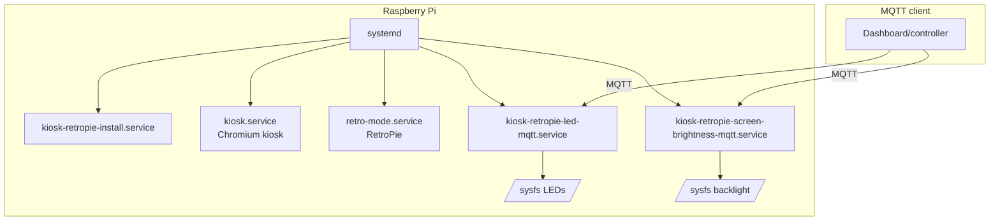
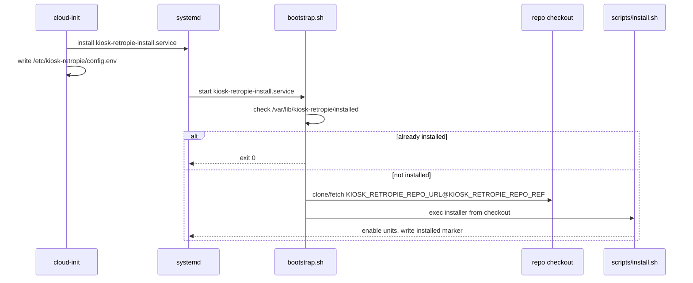
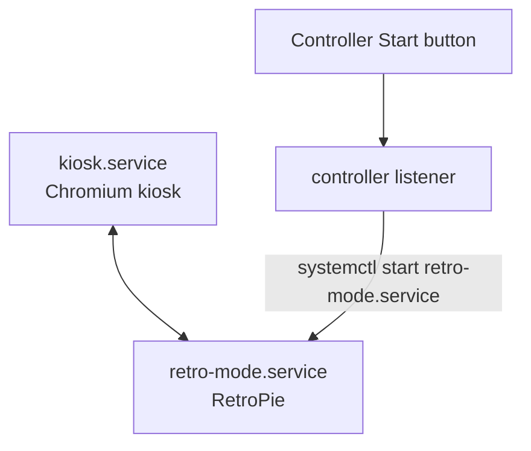

# Architecture

This doc is a quick tour of how kiosk-retropie is put together and what talks to what at runtime.

If you’re new to Raspberry Pi + Linux service plumbing, don’t worry: you don’t need to memorize everything here.
The main idea is simple — one device, one screen, two modes — and `systemd` is the traffic cop that makes it
predictable.

## Glossary

See [Glossary](glossary.md).

## Goals

- Provide two exclusive modes on one Raspberry Pi:
  - Kiosk (default)
  - RetroPie mode (on-demand)
- Enforce single ownership of X at all times.
- Fail open: if kiosk mode is unhealthy, RetroPie remains reachable.
- Keep gameplay independent from network storage.

## Out of scope

- A full desktop environment.
- Running both modes simultaneously.
- Running ROMs directly from NFS.

## High-level component map



systemd (the Linux service manager) runs the show. Scripts are installed under `/usr/local/lib/kiosk-retropie`
and configuration is loaded from `/etc/kiosk-retropie/config.env`.

### Systemd units

Install-time:

- `kiosk-retropie-install.service`: one-time installer (first boot; retried until it succeeds).

Mode and switching:

- `kiosk.service`: kiosk mode, Xorg on VT7 by default.
- `retro-mode.service`: Retro mode, Xorg on VT8 by default.
- `kiosk-mode-controller-listener.service`: listens for controller Start button while kiosk mode is active.
- `emergency-retro-launch.service`: always-on listener on a TTY for emergency Retro launch.
- `kiosk-retropie-failover.service`: invoked by `kiosk.service` OnFailure to switch into Retro.

Periodic maintenance:

- `boot-sync.service`: optional boot-time ROM sync from NFS.
- `healthcheck.service` + `healthcheck.timer`: periodic fail-open check.
- `save-backup.service` + `save-backup.timer`: optional backup of local saves/states to NFS.

Optional integration:

- `kiosk-retropie-led-mqtt.service`: optional MQTT-driven LED control bridge.
- `kiosk-retropie-screen-brightness-mqtt.service`: optional MQTT-driven screen brightness control bridge.

### Installed layout

- `/etc/kiosk-retropie/config.env`: runtime configuration.
- `/usr/local/lib/kiosk-retropie/*.sh`: installed scripts.
- `/usr/local/lib/kiosk-retropie/kiosk-retropie-led-mqtt.sh`: MQTT LED bridge (used by systemd).
- `/usr/local/bin/kiosk-retropie-led-mqtt.sh`: MQTT LED bridge convenience entrypoint.
- `/usr/local/lib/kiosk-retropie/kiosk-retropie-screen-brightness-mqtt.sh`: MQTT screen brightness bridge (used by systemd).
- `/usr/local/bin/kiosk-retropie-screen-brightness-mqtt.sh`: MQTT screen brightness convenience entrypoint.
- `/var/lib/kiosk-retropie/`: appliance state and data (ROMs, saves, marker file).

## Boot and installation flow

First boot is designed to be idempotent (it’s safe to re-run).

If you’re skimming, this is the mental model: cloud-init lays down just enough to let systemd kick off a bootstrap,
and the bootstrap is responsible for fetching the pinned repo ref and running the real installer.



1. A cloud-init user-data file writes `/etc/kiosk-retropie/config.env` and installs
   `/etc/systemd/system/kiosk-retropie-install.service` and `/usr/local/lib/kiosk-retropie/bootstrap.sh`.
2. `kiosk-retropie-install.service` runs after `network-online.target`.
3. `bootstrap.sh` checks for `/var/lib/kiosk-retropie/installed`:
   - If present, it exits successfully.
   - Otherwise it clones/fetches the repo (pinned by `KIOSK_RETROPIE_REPO_URL` + `KIOSK_RETROPIE_REPO_REF`) and execs
     `scripts/install.sh` from that checkout.
4. `scripts/install.sh` installs packages and copies scripts/units into their installed locations,
   enables the required services/timers, then writes the installed marker.

If you want to re-run install without reflashing, delete the marker file and restart the unit.

## Mode ownership and display

Both modes start the X server (Xorg) explicitly via `xinit` and run on fixed VTs (virtual terminals):

- Kiosk: VT7 (`KIOSK_X_VT`, default `7`)
- Retro mode: VT8 (`RETROPIE_X_VT`, default `8`)

systemd enforces exclusivity:

- `kiosk.service` declares `Conflicts=retro-mode.service`.
- `retro-mode.service` declares `Conflicts=kiosk.service`.

Each service is configured to run with a logind session (TTY + `PAMName=login`) so rootless Xorg can
acquire the seat.

In plain terms: `logind` is what gives a user session permission to talk to the keyboard/controller and the
display/GPU. By setting the services up like “real” login sessions, we can run Xorg without running everything as
root.

This is one of the reasons the runtime stays “on the host”: VT + logind + seat ownership is exactly the stuff
systemd is already good at, and we lean into that instead of trying to re-build it in another layer.

## Mode switching

### Manual switching

- Switch to Retro: `systemctl start retro-mode.service`
- Switch to kiosk: `systemctl start kiosk.service`

Because of `Conflicts=`, starting one mode will stop the other.

Here’s the simple picture:



### Controller-driven switching

Two small listener scripts (Bash wrappers that run embedded Python) read controller input from Linux’s `evdev`
interface.

They look under `/dev/input/by-id/` first because those names tend to stay stable across reboots (unlike
`/dev/input/event0`, which can change).

- `kiosk-mode-controller-listener.service`:
  - Requires kiosk to be active.
  - On Start button press, starts `retro-mode.service`.
- `emergency-retro-launch.service`:
  - Runs outside X and stays enabled.
  - On Start button press, stops kiosk and starts Retro.

Controller codes are configurable to support different hardware:

- Enter Retro (kiosk -> Retro): `RETROPIE_ENTER_TRIGGER_CODE` (default `315`)
- Exit Retro (Retro -> kiosk): press `RETROPIE_EXIT_SECOND_CODE` (default `304`), then press
  `RETROPIE_EXIT_TRIGGER_CODE` (default `315`) within `RETROPIE_COMBO_WINDOW_SEC` (default `0.75`).

To discover your controller’s codes on the Pi:

```bash
sudo kiosk-retropie-controller-codes.sh
```

## Fail-open behavior

Fail-open is implemented in two layers:

1. `kiosk.service` uses `OnFailure=kiosk-retropie-failover.service`.
   If kiosk fails repeatedly (StartLimitBurst), systemd runs the failover service.
2. `healthcheck.timer` periodically runs `healthcheck.sh`.
   If neither `kiosk.service` nor `retro-mode.service` is active, it runs `enter-retro-mode.sh`.

## Storage model

The storage design separates gameplay data from network availability.

### ROMs

- ROMs live locally (default: `/var/lib/kiosk-retropie/retropie/roms`).
- If NFS is configured, `boot-sync.service` attempts to mount a share read-only and sync ROMs into the
  local directory.
- If NFS is down, ROM sync is skipped and the device continues to work with the last local ROM set.

### Saves and states

- Saves and savestates are always local:
  - `RETROPIE_SAVES_DIR` (default: `/var/lib/kiosk-retropie/retropie/saves`)
  - `RETROPIE_STATES_DIR` (default: `/var/lib/kiosk-retropie/retropie/states`)
- Optional backup to NFS is implemented as a periodic rsync job and is disabled by default.
- Backup explicitly skips while `retro-mode.service` is active.

## LED behavior and MQTT bridge

LED control is done by writing to sysfs (the Linux kernel device filesystem) via `ledctl.sh`.

If enabled, `kiosk-retropie-led-mqtt.service` subscribes to MQTT topics (default prefix `kiosk-retropie`) and calls
`ledctl.sh` to toggle ACT/PWR LEDs.

It publishes retained state topics (MQTT “retained messages”) for the client UI and periodically
polls sysfs so the client also reflects LED changes made outside MQTT.

## Screen brightness and MQTT bridge

Screen brightness control is done by writing to sysfs via `/sys/class/backlight/<device>/brightness`.

If enabled, `kiosk-retropie-screen-brightness-mqtt.service` subscribes to a brightness percent command topic
(default prefix `kiosk-retropie`), writes the corresponding raw sysfs value, and publishes retained state.

It also periodically polls sysfs so the client reflects brightness changes made outside MQTT.

## Observability and debugging

- Journald (systemd’s logging) is the primary log sink.
- Most issues can be diagnosed with:

```bash
systemctl status kiosk.service retro-mode.service kiosk-retropie-install.service
journalctl -u kiosk.service -b --no-pager
```

See the troubleshooting guide for symptom-based diagnosis.

## Security notes (practical)

- This project assumes a trusted LAN. It does not expose a network API by default.
- MQTT credentials (if used) are stored in `/etc/kiosk-retropie/config.env`; treat that file as sensitive.
- Scripts are installed under `/usr/local` and run under a dedicated `retropi` user for kiosk/retro
  services.
